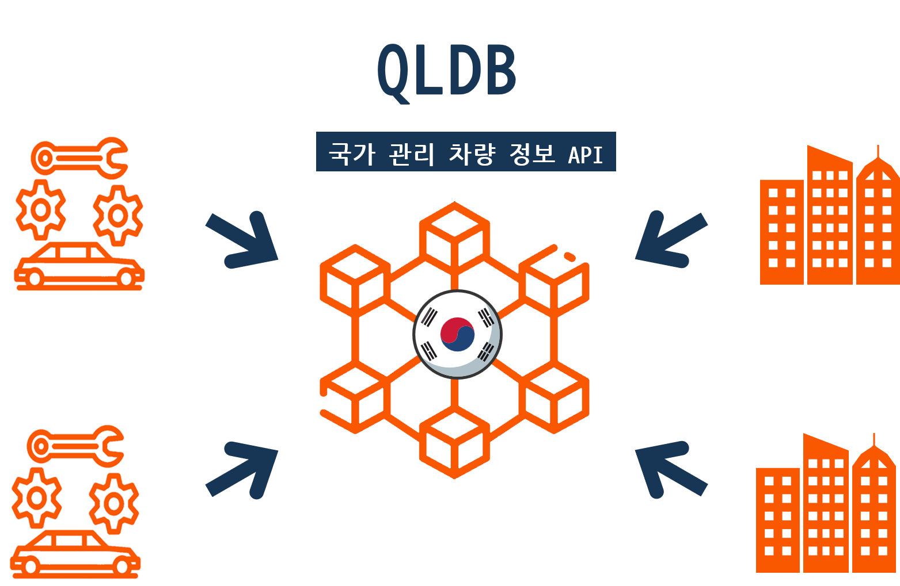
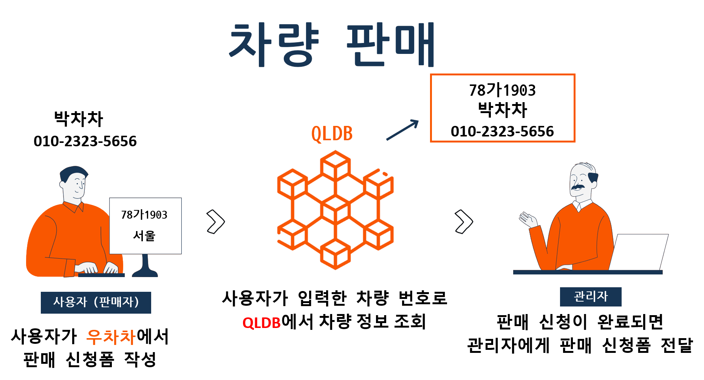
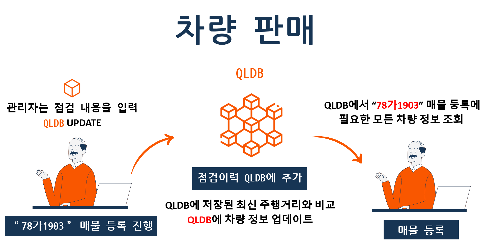
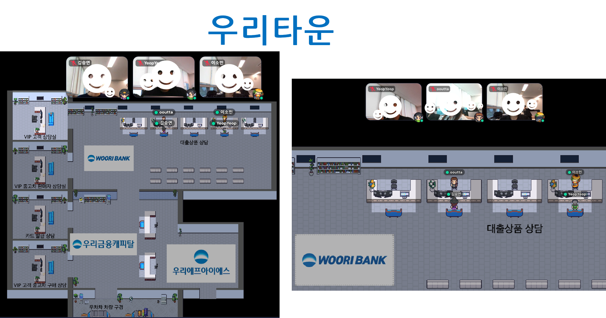
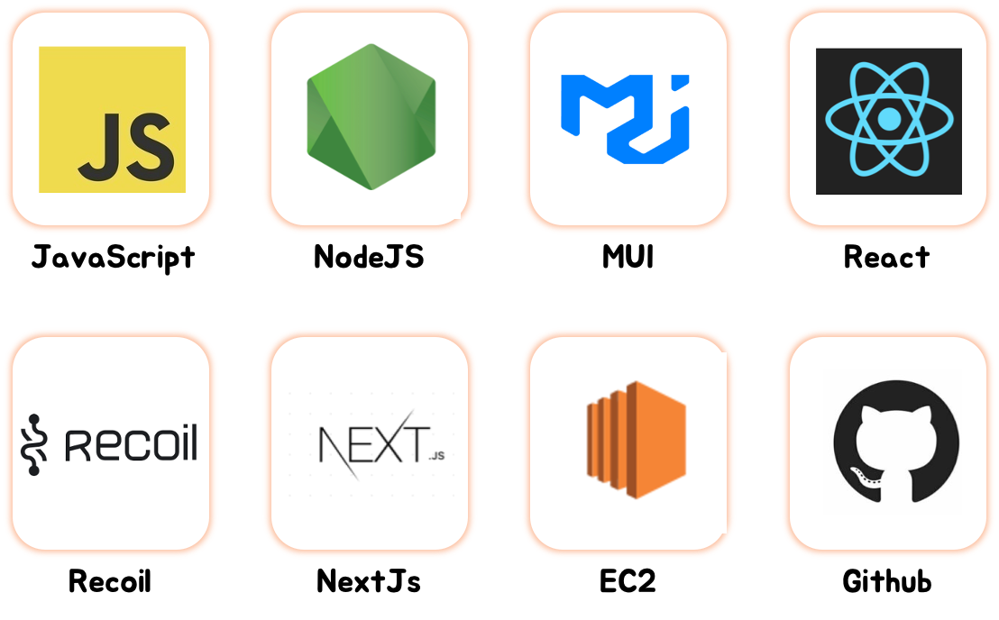
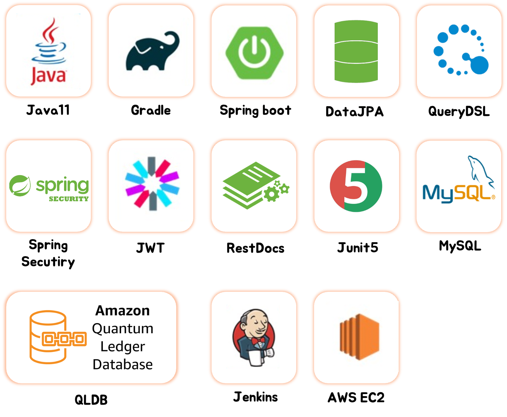
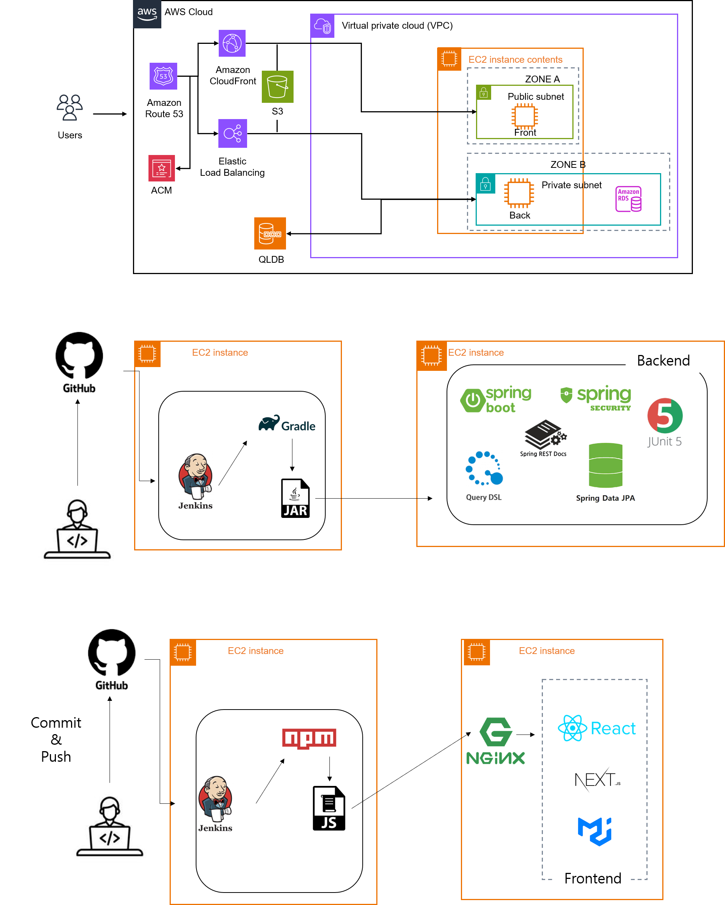

# 우리가 찾는 차, WOOCHACHA

## 허위 매물 걱정 없는 중고차 플랫폼

블록체인 기반의 QLDB 기술로 허위 매물 걱정 없이 중고차 판매와 구매부터,  
메타버스 기술로 편리한 대출 상담까지 한 번에!  

[Backend REST Docs API 명세서 - 사용자](https://server.web.back.woochacha.store/docs/user.html)
[Backend REST Docs API 명세서 - 관리자](https://server.web.back.woochacha.store/docs/admin.html)

   

## 우차차의 허위 매물 방지 기능을 소개합니다!
### QLDB

✅ QLDB는 국가에서 관리하는 블록체인 기반기술로, 모든 실제 차량 정보와 소유주 정보가매칭되어 등록되어 있다고 가정합니다.  
✅ QLDB에는 차량과 관련된 모든 정보(소유주명,소유주 전화번호, 교체이력, 사고이력, 주행거리 등가 저장되며, 정비소, 본 플랫폼과 같은 자동차 관련사업자에 의해 이 정보는 지속적으로 업데이트됩니다.  
✅ QLDB 데이터베이스는 history기능을 이용해데이터의 수정 내역을 모두 조회할 수 있어 악의적인데이터 수정이 불가능합니다. 따라서 주행 거리를조작하거나 교체 이력 또는 사고 이력의 조작이불가합니다.  

✅ 차량 판매 신청 시 QLDB에저장되어 있는 차량 번호와 소유주 이름, 전화번호를사용자가 입력한 차량번호와 사용자명, 전화번호를비교하고 일치하지 않을 시 차량 판매 신청이불가합니다.  
✅ 매물 판매글을 등록할 때는QLDB에서 조회한 데이터를 이용해 게시글을 등록하기때문에 모든 차량 정보는 조작되지 않았음을보장합니다.  

✅ 매물 등록 시 차량 이미지, 업데이트 된 정(주행 거리, 차량 이미지 등)을 모두 관리자가입력하고 관리하기 때문에 본 플랫폼에서 거래되는모든 매물의 정보는 조작되지 않았음을 보장합니다.
   

## 매타버스로 편리한 실시간 대출 상담 받기

💡 메타버스 상에서 자동차 구매를 위해 필요한 대출 상담을 실시간으로 받을 수 있습니다.  
💡 대출 또는 자동차와 관련하여 같은 관심사를 가진 고객은 서로 대화를 나누며 정보를 교환할 수 있습니다.   

## Skills

   

## Infrastructure

   

## 팀원을 소개합니다!
|                                              [이은엽](https://github.com/ShinChanCoding)                                               |                                                       [김승연](https://github.com/seungg-0)                                                       |                                              [김수현](https://github.com/ooutta)                                               |                                              [이소민](https://github.com/purin48)                                              |
| :----------------------------------------------------------------------------------------------------------------------------- | :------------------------------------------------------------------------------------------------------------------------------------------------ | :------------------------------------------------------------------------------------------------------------------------------ | :------------------------------------------------------------------------------------------------------------------------------- |
|  |                   |  |  |
|                                                             백엔드,  프론트엔드                                                     |                                                                       백엔드, 프론트엔드                                                                       |                                                            백엔드, 테스트                                                            |                                                            프론트엔드                                                             |
|💡 개발 환경 구축   💡 매물 거래 기능 개발   💡 사용자 관리 시스템(관리자) 개발   💡 블록체인 기술 기반 DB (QLDB) 서버 개발  💡 차량 허위 매물 검토 기능 개발   💡 SMS 발송 기능 개발 (전화번호 인증)   💡 사용자 페이지 UI/UX 설계   💡 JPQL, QueryDSL을 통한 RDS 사용   💡 AWS 운영 환경 설정(EC2, Jenkins, DB 이중화, HTTPS)   💡 예외처리   💡 REST Docs를 사용한 단위 테스트 구현 |💡 ERD, 데이터베이스 설계   💡 JPQL 도입 및 활용   💡 블록체인 기반 DB(QLDB)에서 매물 정보를 조회하고 RDS에 저장하는 로직 구현   💡 사용자 마이페이지, 매물관리 시스템   💡 관리자 로그관리 시스템   💡 매물 상세 페이지 UI/UX 구현   💡 예외처리  💡마이페이지, 매물 관리 API 연동| 💡 인증/인가 시스템(Spring Security+JWT)   💡 QueryDSL 도입 및 활용   💡 필터링, 키워드 검색을 통한 상품 검색 시스템   💡 상품 전체 조회, 상품 상세 조회 시스템   💡 회원가입/로그인 예외처리 시스템   💡 로그 관리 시스템   💡 회원가입/로그인 시 이용 제한 회원 인증 차단  시스템 구현   💡 REST Docs를 사용한 단위 테스트 구현   💡 Cypress를 사용한 통합 테스트 |💡 초기 개발 환경 셋팅   💡 프론트 사용자&관리자 프레임 구축   💡 공통 컴포넌트 구현   💡 사용자&관리자 API 연동   💡 프론트 반응형 구현   💡 프론트 유효성 처리   💡 화면 전반적인 UI / UX 설계|

